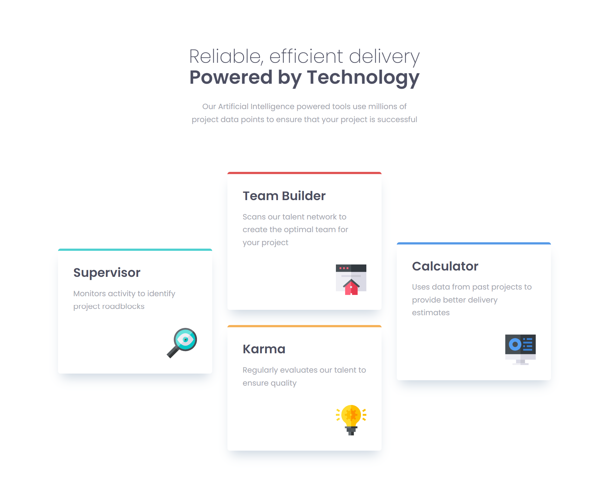

# Frontend Mentor - Four card feature section solution

This is a solution to the [Four card feature section challenge on Frontend Mentor](https://www.frontendmentor.io/challenges/four-card-feature-section-weK1eFYK). Frontend Mentor challenges help you improve your coding skills by building realistic projects.

## Table of contents

- [Overview](#overview)
  - [The challenge](#the-challenge)
  - [Screenshot](#screenshot)
  - [Links](#links)
- [My process](#my-process)
  - [Built with](#built-with)
  - [What I learned](#what-i-learned)
  - [Continued development](#continued-development)
- [Author](#author)

## Overview

The Four Card Feature Section is a component of a website designed to showcase four key features or services offered by a business or organization. This section provides a visually appealing layout with concise descriptions of each feature, enhancing user engagement and understanding of the offered services.

### The challenge

Users should be able to:

- View the optimal layout for the site depending on their device's screen size

### Screenshot



### Links

- Solution URL: [four-card-feature-section](https://app.netlify.com/sites/four-card-feature-section-2024)
- Live Site URL: [four-card-feature-section](https://app.netlify.com/sites/four-card-feature-section-2024)

## My process

- Planning on how to structure my HTML file.
- Choosing a best way to structure the four cards using CSS.
- Writing HTML code to structure the feature cards.
- Applying CSS styles to enhance the visual presentation of the feature cards.
- Implementing responsive design techniques using media queries to ensure the section displays properly on various devices and screen sizes.
- Testing the feature section across different browsers and devices to ensure compatibility and consistent rendering, for this particular project tested on chrome, and firefox.
- Deploying the feature section on Netlify.

### Built with

- Semantic HTML5 markup
- CSS custom properties
- Flexbox
- CSS Grid
- Mobile-first workflow

### What I learned

- I have learned how to use HTML and CSS to structure the HTML markup effectively and apply CSS styles to achieve desired layouts and designs.
- I have also improved my design skills with Flexbox and CSS Grid.

```css
.grid-layout {
  --grid: 2rem;

  display: grid;
  gap: var(--grid);
}
```

- Responsive Design Techniques: Using media queries and flexible layouts.

```css
@media (min-width: 800px) {
  .grid-layout {
    grid-template-columns: 1fr 1fr 1fr;
  }
}
```

### Continued development

- Flexbox Techniques: Master alignment, nesting, shorthand properties, and troubleshooting for efficient and flexible layouts.
- CSS Grid Techniques: Understand grid layout basics, item placement, gap control, and auto-placement for creating structured and responsive designs.
- Responsive Design Techniques: Practice fluid layout design, media query usage, mobile-first approach, and flexible sizing for seamless adaptability across devices.

## Author

- Netlify - [Patrick Odida](https://app.netlify.com/teams/podida67/overview)
- Frontend Mentor - [@patrickodida](https://www.frontendmentor.io/profile/Patrickodida)
- Linkedin - [@patrickodida](https://www.linkedin.com/in/patrick-odida-20b882212/)
