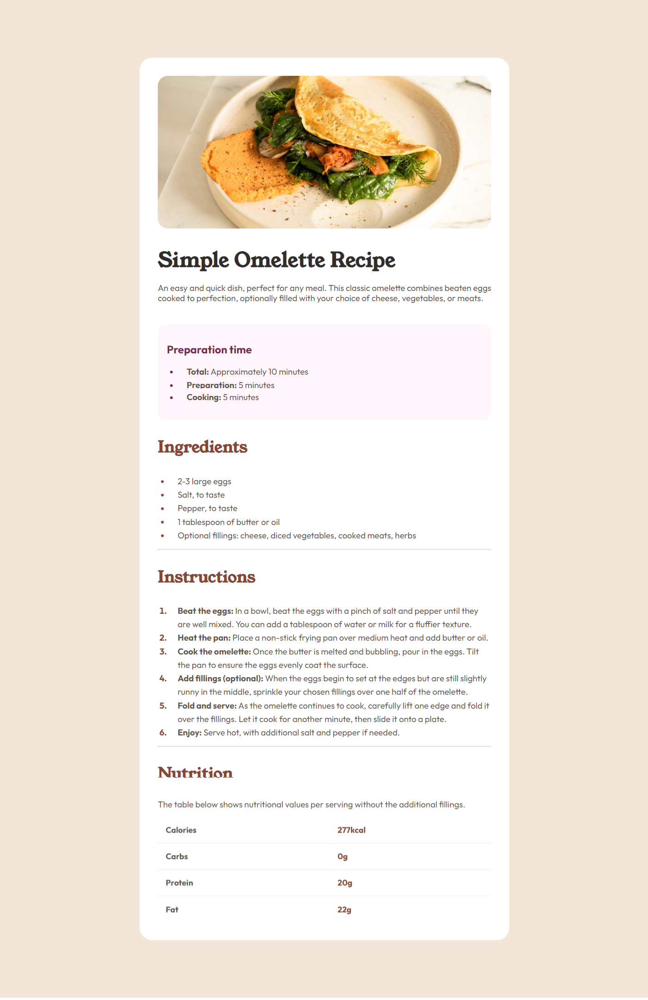

# Frontend Mentor - Recipe page solution

This is a solution to the [Recipe page challenge on Frontend Mentor](https://www.frontendmentor.io/challenges/recipe-page-KiTsR8QQKm). Frontend Mentor challenges help you improve your coding skills by building realistic projects.

## Table of contents

- [Overview](#overview)
  - [The challenge](#the-challenge)
  - [Screenshot](#screenshot)
  - [Links](#links)
- [My process](#my-process)
  - [Built with](#built-with)
  - [What I learned](#what-i-learned)
  - [Continued development](#continued-development)
- [Author](#author)

## Overview

The Recipe Page project aims to develop a dynamic and user-friendly web page dedicated to sharing various recipes. This project leverages HTML, CSS, to create an interactive platform.

## The Challenge

To build a responsive recipe page and getting it look as close to the design as possible.

### Screenshot

### Links

- Solution URL: [patrick odida](https://recipe-page-2024.netlify.app/)
- Live Site URL: [patrick odida](https://recipe-page-2024.netlify.app/)

## My process

- HTML Structure: Write clean and semantic HTML markup to structure the content of the recipe page.
- CSS Styling: Apply CSS styles to enhance the visual presentation, layout, and responsiveness of the page elements.
- Responsive Design: Ensure that the recipe page is fully responsive and optimized for seamless viewing and interaction across various devices and screen sizes.
- Cross-browser / Device testing. conduct testing of the recipe page across multiple web browsers (e.g., Chrome, Firefox, Safari, Edge), and devices (e.g Desktops, laptops, tablets, smartphones) to ensure compatibility and consistency and to verify responsiveness and functionality respectively.
- Deployment. Hosting using Netlify.

### Built with

- Semantic HTML5 markup
- CSS3 custom properties
- Mobile-first workflow

### What I learned

I have learned how to write semantic HTML, by writing each piece of element with the most appropriate HTML element.

### Continued development

- Responsiveness. Improve on my responsive designs.

## Author

- Netlify - [Patrick Odida](https://recipe-page-2024.netlify.app/)
- Frontend Mentor - [@patrickodida](https://www.frontendmentor.io/profile/Patrickodida)
- Linkedin - [@patrickodida](https://www.linkedin.com/in/patrick-odida-20b882212/)
